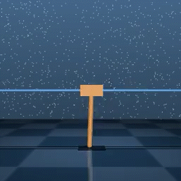
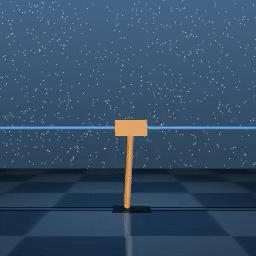
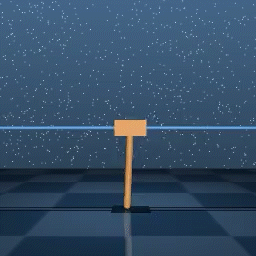
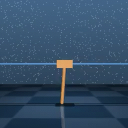
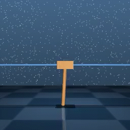

# CURL + Gym

I used the [CURL](https://github.com/MishaLaskin/curl) algorithm to learn the agent through the Pixel value in the [gym](https://www.gymlibrary.dev/) environment.


[PixelObservationWrapper](https://www.gymlibrary.dev/api/wrappers/) was used to receive Raw Pixel as observation, not Physical State Value.
```python
env = PixelObservationWrapper(gym.make(args.domain_name))
```


## How to run
### Pendulum Environment
```bash
bash ./script/run_pendulum.sh
```


## Result
I compared the performance of CURL with the performance of SAC with physical state value environment.

### Original CURL Performance in DM_Control
in [CURL(Contrastive Unsupervised Representation Learning for Sample-Efficient Reinforcement Learning)](https://mishalaskin.github.io/curl/), 
Agent was trained in [DM_Control](https://github.com/deepmind/dm_control)


I check the performance of CURL in CartPole environment in DM_Control
|                                  |                                                |
| :------------------------------: | :--------------------------------------------: |
|         `Step 5000`          |                 `Step 10000`                 |
|  |                  |
|         `Step 15000`          |             `Step 20000`             |
|  |  |
|         `Step 25000`          |              `Step 30000`                    |
|  |  |


