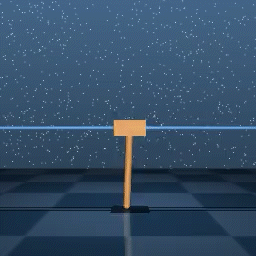

# CURL + Gym

I implemented the [CURL](https://github.com/MishaLaskin/curl) algorithm to learn the agent.    
[CURL(Contrastive Unsupervised Representation Learning for Sample-Efficient Reinforcement Learning)](https://github.com/MishaLaskin/curl) is a learning algorithm based on Raw Pixel Observations.
 
I applied the CURL algorithm in the [gym](https://www.gymlibrary.dev/) environment, which doesn't use Pixel Observation but rather Physical Information Observation. This was accomplished by utilizing the [PixelObservationWrapper](https://www.gymlibrary.dev/api/wrappers/)
   
**Option**
```bash
# Specific gym environment has dependency of Pyglet Version
pip uninstall pyglet
pip install pyglet==1.5.0
```


**Pixel Observation Wrapping Method**
```python
env = PixelObservationWrapper(gym.make(args.domain_name))
```


## How to run
### Pendulum Environment
```bash
bash ./script/run_pendulum.sh
```


## Result
I compared the performance of CURL with the performance of SAC in a Physical Information Observation environment.

### 01. Original Performance of the CURL in DM_Control
in [CURL](https://mishalaskin.github.io/curl/), 
the agent was trained in [DM_Control](https://github.com/deepmind/dm_control) environment.


**I checked the performance of CURL in the 'CartPole' environment of the DM_Control**
|                                  |                                                |                                                |
| :------------------------------: | :--------------------------------------------: | :--------------------------------------------: |
|         `Step 5000`                |                 `Step 10000`                 |                   `Step 15000`                 |
|    |            |              |
|         `Step 20000`               |             `Step 25000`                     |             `Step 30000`                       |
|  |            |              |


Though CURL is a raw Pixel Based Learning method, its sample efficiency was apparent: the learning performance with CURL was comparable to the learning with physical information (in the case of the CartPole environment).


### 02. Applying CURL to Gym and Comparing Performance with Dynamic State-Based SAC

**Raw Pixel Observation-Based Learning with CURL in Gym**   
|                                  |                                                |                                                |
| :------------------------------: | :--------------------------------------------: | :--------------------------------------------: |
|         `Step 5000`                |                 `Step 10000`                 |                   `Step 15000`                 |
|    |            |              |

Below is the Physical Observation-Based Learning using the [SAC](https://github.com/vy007vikas/PyTorch-ActorCriticRL) learning algorithm in the [gym](https://www.gymlibrary.dev/environments/)   
   
**Physical Observation-Based Learning with SAC in Gym**   
[details of Observation](https://www.gymlibrary.dev/environments/classic_control/pendulum/)
|                                  |                                                |                                                |
| :------------------------------: | :--------------------------------------------: | :--------------------------------------------: |
|         `Step 5000`                |                 `Step 10000`                 |                   `Step 15000`                 |
|    |            |              |

