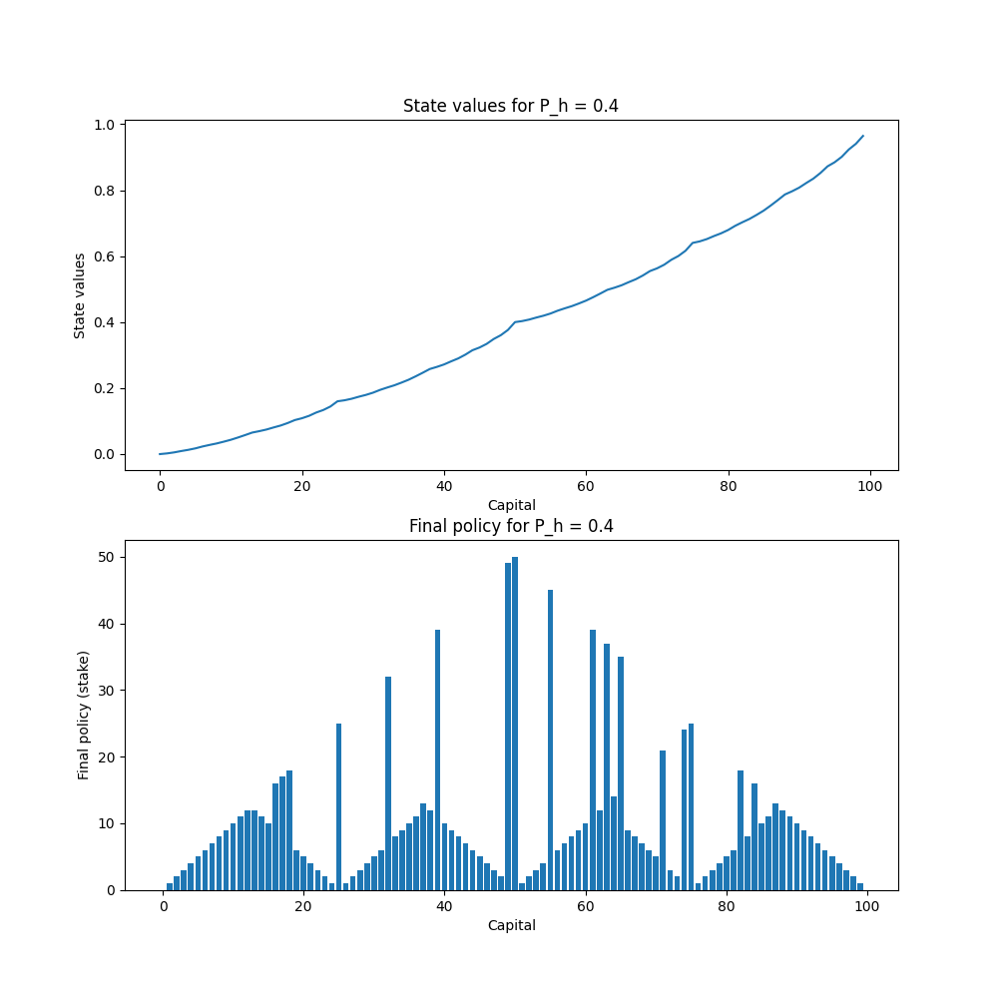

# Solving Gambler's Problem

I have implemented Action-Value based DP and State-Value based DP.


In State-Value based DP, 
I implemented DP with two different ways: Bellman Optimality Equation and Bellman Expectation Equation.
Action-Value based DP is implementeted with Q_action value.


There is no big difference in three methods.


action value dp method
```bash
python action_value.py
```
state value dp method
```bash
python state_value.py
```

***


### Ph=0.25


### Ph=0.55


### Ph=0.4 (Same With Sutton's Book ex 4.3)



