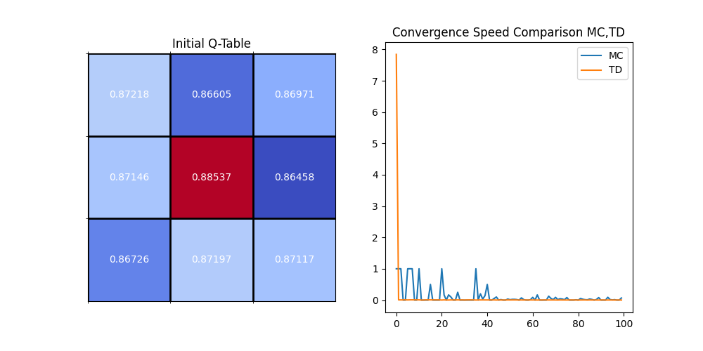

# Solving Tic Tac Toe Game


I have implemented Tic Tac Toe Game with MC and TD Policy Evaluation.


### Monte Carlo Policy Evaluation
By using Monte Carlo Policy Evaluation, I can get the optimal First Action of the game.


### Temporal Difference Policy Evaluation
By using Temporal Difference Policy Evaluation, I can compare the convergence speed of the two methods.


## How to run

### Convergence Speed Comparison of TD and MC
```bash
python main.py
``` 


### Monte Carlo Policy Evaluation
```bash
python main_MC.py
```

### Temporal Difference Policy Evaluation
```bash
python main_TD.py
```


***


